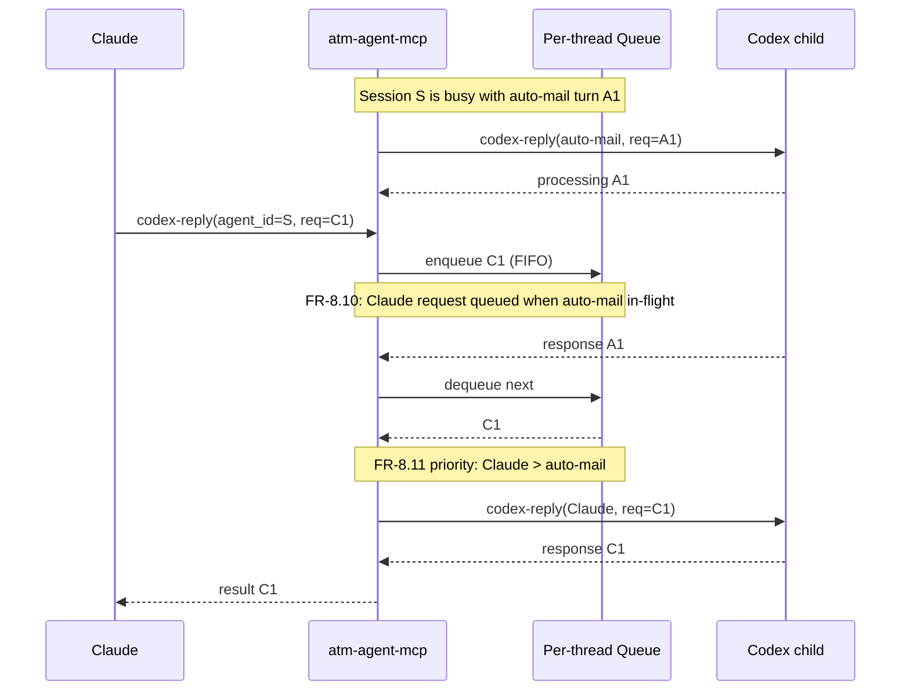
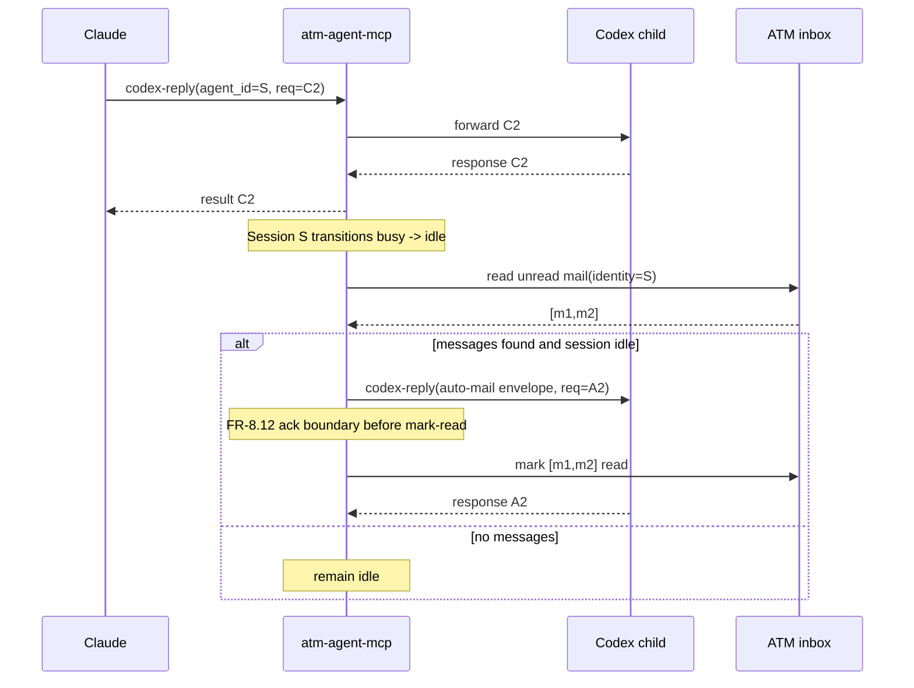
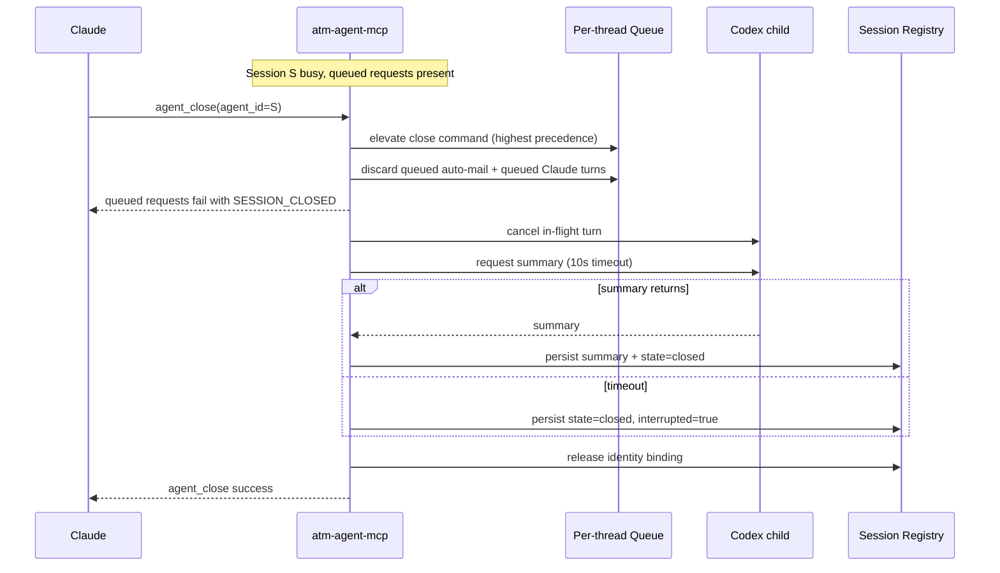

# atm-agent-mcp Requirements

> **Status**: APPROVED by team-lead + arch-ctm (2026-02-18, updated: single-proxy-multi-session model)
> **Crate**: `crates/atm-agent-mcp`
> **Binary**: `atm-agent-mcp`

---

## 1. Problem Statement

Codex CLI can run as an MCP server (`codex mcp-server`), exposing `codex` and `codex-reply` tools for starting and continuing agentic coding sessions. However, using Codex as a Claude subagent today requires manual setup of identity, team context, communication channels, and session persistence.

**Current pain points:**
- No automatic identity/team injection — every call must manually set context
- No persistent session management — threadIds are lost between Claude sessions
- No native ATM integration — Codex must shell out to `atm` CLI, triggering approval policy friction
- No incoming mail handling — Codex can't reactively respond to team messages
- No session resume — context is lost on shutdown/crash
- No subagent awareness — Codex's native multi-agent tools are disconnected from ATM

**Goal:** A thin Rust MCP proxy that wraps a single `codex mcp-server` child process, managing multiple concurrent Codex sessions (threads) with per-session identity, team context, communication, and lifecycle. `atm-agent-mcp` is the general name for this agent-oriented proxy layer; Codex is the first supported backend.

> **Architecture Decision**: One proxy instance manages one Codex child process and 0..N concurrent agent sessions. Each session has an `agent_id` (proxy-assigned, exposed to Claude) which maps internally to a Codex `threadId`. Each `agent_id` maps 1:1 to an ATM identity while active. The proxy owns the identity namespace — no external collision detection needed.
>
> **Naming Convention**: `agent_id` is the MCP tool parameter Claude uses to reference sessions. Internally, the proxy maps `agent_id` -> Codex `threadId`. This avoids collision with Claude Code's `agentId` (Task tool) namespace.

### Lifecycle Overview

1. Claude starts `atm-agent-mcp` and calls `codex` (new session) or `codex-reply` (existing session).
2. Proxy lazily starts the Codex child process on first request.
3. Proxy assigns or resolves `agent_id`, binds identity, refreshes runtime context, and forwards the turn.
4. Session state transitions through `busy` -> `idle` until `agent_close` or shutdown.
5. ATM messages addressed to bound identities are delivered by deterministic identity routing.
6. Registry/audit/summaries persist under team-scoped paths for resume and review.

---

## 2. Actors

| Actor | Description |
|-------|-------------|
| **Claude** | MCP client (orchestrator). Sends `codex`/`codex-reply` tool calls. |
| **atm-agent-mcp** | MCP proxy server. Intercepts, augments, and forwards requests. |
| **codex mcp-server** | Downstream Codex MCP server (child process). |
| **Codex subagents** | Native subagents spawned by Codex via `spawn_agent`. |
| **ATM team members** | Other agents (Claude teammates, humans, CI) communicating via ATM. |

---

## 3. Functional Requirements

### FR-1: MCP Proxy Pass-Through

- **FR-1.1**: Proxy MUST forward all standard MCP requests/responses between Claude and `codex mcp-server` without modification, except for intercepted tool calls listed below.
- **FR-1.2**: Proxy transport framing is directional: **downstream (proxy↔Codex child) MUST use newline-delimited JSON**, matching Codex MCP server behavior (Appendix A.3). **Upstream (Claude↔proxy) MUST accept both Content-Length framed JSON-RPC and newline-delimited JSON** for compatibility across MCP clients.
- **FR-1.3**: Proxy MUST handle `codex mcp-server` process lifecycle (lazy spawn on first Codex request, terminate on shutdown, detect crashes).

### FR-2: Per-Thread Identity and Context Injection

> **Design Decision**: Identity is per-session, not per-proxy. Each `codex` call specifies (or defaults) an identity. The proxy maintains a 1:1 mapping of agent_id→identity and enforces uniqueness.

- **FR-2.1**: On `codex` and `codex-reply` calls, proxy MUST inject `developer-instructions` containing session context (identity, team, repo_root, repo_name, branch, cwd). Identity is determined from session binding rules (see FR-2.5 / FR-2.8).
- **FR-2.2**: If caller already provides `developer-instructions`, proxy MUST append (not replace) its context.
- **FR-2.3**: If caller provides `base-instructions`, proxy MUST respect it and only inject via `developer-instructions`.
- **FR-2.4**: Proxy MUST set `cwd` to caller-supplied `cwd` when present, otherwise to `repo_root` if available. If not in a git repo, `repo_root` and `repo_name` MUST be `null` (not derived from `cwd`).
- **FR-2.5**: Identity for a new session is determined by: explicit `identity` parameter in the `codex` call → proxy default from config (`[plugins.atm-agent-mcp].default_identity`) → "codex". The proxy MUST reject a `codex` call that requests an identity already bound to an active session (return error with the conflicting `agent_id`).
- **FR-2.6**: Runtime context (branch, repo_root, repo_name, cwd) MUST be refreshed on each turn (`codex` and `codex-reply`). If launch-time values are also included, they MUST be explicitly labeled as launch-time snapshots.
- **FR-2.7**: Per-thread `cwd` MUST be persisted in the registry so that `codex-reply` calls can restore the correct working directory for each thread.
- **FR-2.8**: On `codex-reply`, proxy MUST look up the `agent_id` in the registry to resolve the bound identity. ATM tools called within that session use that identity automatically.

### FR-3: Identity Namespace Management

> **Design Decision**: Identity uniqueness is enforced at two levels: in-process map for per-instance thread routing (this section), and cross-process lock/claim checks for multi-instance safety (FR-20.1).

- **FR-3.1**: Proxy MUST maintain an in-memory map of identity→agent_id. A `codex` call requesting an identity already bound to an active session MUST be rejected with an error indicating the conflict.
- **FR-3.2**: On startup, proxy MUST load the persisted registry and mark all previously-active threads as "stale" (since the previous proxy process is gone). Stale threads may be resumed via `--resume` or their identities reused by new threads.
- **FR-3.3**: Proxy MUST support a `max_concurrent_threads` config (default: 10) to prevent unbounded resource consumption.
- **FR-3.4**: When a thread completes or is explicitly closed, its identity MUST be released and available for reuse by a new `codex` call.

### FR-4: ATM Communication Tools

> **Design Decision**: MCP tool parameters mirror CLI options where applicable. Flags like `--json`, `--stdin`, `--file` are omitted (MCP is already structured). Sender identity is always the session's bound identity — no `--from` override (anti-spoofing by design).

- **FR-4.1**: Proxy MUST expose `atm_send`, `atm_read`, `atm_broadcast`, and `atm_pending_count` as MCP tools in the `tools/list` response.
- **FR-4.2**: `atm_send` parameters: `to` (required, agent or `agent@team` for cross-team), `message` (required), `summary` (optional, auto-generated if omitted). The proxy parses `@` notation into separate recipient/team fields.
- **FR-4.3**: `atm_read` parameters: `all` (optional, default false — include read messages), `mark_read` (optional, default true), `limit` (optional — max messages to return), `since` (optional — ISO 8601 timestamp filter), `from` (optional — filter by sender name). Returns array of `{from, message, timestamp, message_id}`.
- **FR-4.4**: `atm_broadcast` parameters: `message` (required), `summary` (optional), `team` (optional — override target team for cross-team broadcasts). MUST send to all team members via `atm-core`.
- **FR-4.5**: All ATM tools MUST use the calling thread's bound identity as sender — no impersonation. ATM tools called outside a thread context (e.g., from Claude directly via MCP) MUST require an explicit `identity` parameter; if omitted, the call MUST be rejected with an error.
- **FR-4.6**: All ATM tool calls MUST be logged to an audit trail (see FR-9).
- **FR-4.7**: `atm_pending_count` takes no required parameters. Returns unread message count without marking anything read. Intended for lightweight mail polling.

### FR-20: Multi-Instance and Subagent Visibility

> **Design Decision**: Multiple proxy instances may run in the same repo (e.g., two Claude teammates each with their own `atm-agent-mcp`). Codex subagents are invisible to the team — only the proxy's bound identity is a team member.

- **FR-20.1**: Each proxy instance MUST have a distinct identity. Two instances with the same identity in the same team MUST be rejected (identity conflict per FR-2). On startup, the proxy MUST check for existing identity claims via a lock file or registry marker at `~/.config/atm/agent-sessions/<team>/<identity>.lock` to prevent cross-process races.
- **FR-20.2**: Multiple proxy instances in the same repo MUST share the same `~/.claude/teams/` inbox files. Shared message history is expected and correct — each instance reads/writes the same team directory.
- **FR-20.3**: Each proxy instance maintains its own independent session registry. Thread-to-identity mappings are per-instance, not shared.
- **FR-20.4**: Codex subagents spawned via `spawn_agent` within a session MUST NOT receive their own ATM identity, inbox, or team membership. They are invisible to the team — analogous to Claude Code's background sub-agents.
- **FR-20.5**: The proxy's bound identity is the sole team-visible identity for all communication originating from that session, including any tool calls made by Codex subagents.

### FR-5: Thread Registry and Persistence

- **FR-5.1**: Proxy MUST track all active sessions in an in-memory registry, persisted to disk on every session creation/update.
- **FR-5.2**: Registry entries MUST include: agent_id, backend_id (Codex threadId), identity, team, repo_root, repo_name, branch, cwd, started_at, last_active, status, tag (optional, for organizational labeling).
- **FR-5.3**: Registry MUST use a per-instance file at `~/.config/atm/agent-sessions/<team>/<identity>/registry.json`. Atomic writes (via `atm-core`) are required. Cross-process identity collisions are prevented by FR-20.1 lock/claim checks.
- **FR-5.4**: On `codex`/`codex-reply` response, proxy MUST extract the Codex `threadId`, assign an `agent_id`, and register the mapping.
- **FR-5.5**: Registry MUST be persisted atomically on every state change (thread create, update, close) to survive proxy crashes.

### FR-6: Session Resume

- **FR-6.1**: `atm-agent-mcp serve --resume` MUST resume the most recent session for this identity by prepending the saved summary to `developer-instructions` on the first turn.
- **FR-6.2**: `atm-agent-mcp serve --resume <agent-id>` MUST resume a specific session.
- **FR-6.3**: If no summary exists for the resumed thread (crash/SIGKILL), proxy MUST resume without summary context and log a warning.
- **FR-6.4**: Summary files written to `~/.config/atm/agent-sessions/<team>/<identity>/<backend-id>/summary.md`.

### FR-7: Graceful Shutdown

- **FR-7.1**: On SIGTERM/SIGINT, proxy MUST request a compacted summary from each active thread via `codex-reply` with a summary prompt.
- **FR-7.2**: Summary request MUST have a 10-second timeout. If timed out, persist registry with status "interrupted".
- **FR-7.3**: Proxy MUST persist final registry state, deregister all thread identities from team, and terminate child process.
- **FR-7.4**: On parent disconnect (stdio EOF), proxy MUST treat as SIGTERM equivalent.

### FR-8: Incoming Mail Handling (Automatic Turn Injection)

> **Design Decision**: The MCP protocol constraint (server cannot push to client) applies to the Claude→proxy direction. However, the proxy owns the `codex mcp-server` child process and CAN initiate `codex-reply` calls to it directly. Mail delivery uses automatic turn injection at the proxy→Codex boundary.

**Mail delivery triggers:**

- **FR-8.1**: **Post-turn mail check** — When a Codex turn ends (proxy receives the response from `codex mcp-server`), proxy MUST check for unread mail addressed to the thread's bound identity. If mail exists, proxy MUST automatically issue a `codex-reply` with the mail content, starting a new Codex turn.
- **FR-8.2**: **Idle mail delivery** — If no Codex turn is active for a thread's identity and mail arrives, proxy MUST automatically start a new Codex turn via `codex-reply` with the mail content. The proxy polls for new mail on a configurable interval (default: 5s) when threads are idle.
- **FR-8.3**: **Mail routing** — Mail is always delivered to the thread bound to the addressed identity (1:1 mapping). No heuristic routing. If no thread is bound to the addressed identity, mail remains unread in the ATM inbox.

**Mail content handling:**

- **FR-8.4**: Mail content injected into `codex-reply` MUST be wrapped in a structured envelope (sender, timestamp, message_id) — raw message text MUST NOT be injected directly as tool instructions to reduce prompt-injection risk.
- **FR-8.5**: Mail injection MUST support a `max_messages` parameter (default 10) and `max_message_length` (default 4096 chars, truncate with indicator) to prevent inbox bursts from overwhelming context.
- **FR-8.6**: Messages MUST only be marked as read AFTER the `codex-reply` containing those messages has been successfully sent to the child process (at-least-once semantics).

**Turn serialization (per-thread):**

- **FR-8.9**: Each thread MUST enforce a **single-flight rule**: only one `codex-reply` (from any source — Claude, auto-mail, resume) may be in-flight at a time per thread.
- **FR-8.10**: If a Claude-initiated `codex-reply` arrives while an auto-mail turn is in-flight, the Claude request MUST be queued (FIFO). Auto-mail injection MUST NOT start if a Claude request is queued or in-flight for that thread.
- **FR-8.11**: Turn source priority: Claude-initiated > auto-mail. If both are pending when a turn completes, Claude's request is dispatched first; auto-mail waits for the next idle window.

**Delivery acknowledgment:**

- **FR-8.12**: "Successfully sent" (FR-8.6) means: the `codex-reply` JSON-RPC request has been written to the child's stdin AND the proxy has recorded the request-id in its in-memory turn tracker. Messages are marked read only after both conditions are met.
- **FR-8.13**: On proxy crash between send and mark-read, messages remain unread (at-least-once). On restart, proxy MUST detect unacked mail (still marked unread) and re-deliver on next idle cycle. Duplicate delivery is acceptable; Codex agents MUST tolerate replayed mail (message_id enables dedup at the agent level).

**Pull model (supplementary):**

- **FR-8.7**: Proxy MUST still expose `atm_read` and `atm_pending_count` as MCP tools for Claude to explicitly check/read mail when needed (e.g., before deciding whether to start a new thread).
- **FR-8.8**: Auto-injection (FR-8.1/8.2) MUST be configurable and can be disabled per-thread or globally via `[plugins.atm-agent-mcp].auto_mail = false`.

### FR-9: Audit Log

- **FR-9.1**: Proxy MUST log all ATM tool calls (send, read, broadcast) with timestamp, identity, recipient, and message summary.
- **FR-9.2**: Proxy MUST log all `codex`/`codex-reply` forwards with timestamp, agent_id, and prompt summary (first 200 chars).
- **FR-9.3**: Audit log written to `~/.config/atm/agent-sessions/<team>/audit.jsonl` (single proxy-wide log per team). Each entry includes `agent_id` and `identity` fields for per-session filtering. Per-identity views are derived, not stored separately.

### FR-10: Proxy Management MCP Tools

- **FR-10.1**: Proxy MUST expose `agent_sessions` tool — returns active and resumable sessions with fields: `agent_id`, `backend`, `backend_id` (Codex threadId), `team`, `identity`, `agent_name` (if prompt file used), `agent_source` (prompt file path if applicable), `status`, `last_active_at`, `tag` (if set), and `resumable`.
- **FR-10.2**: Proxy MUST expose `agent_status` tool — returns proxy health (child process alive, team, uptime, active thread count, identity→thread mapping, aggregate pending mail count).

### FR-11: Codex Process Health

- **FR-11.1**: Proxy MUST detect child process (`codex mcp-server`) crashes and report error to Claude on next request.
- **FR-11.2**: Proxy MUST NOT auto-restart the child process. Return an error indicating the child died, with the exit code/signal.
- **FR-11.3**: Claude can decide to restart by closing and re-opening the MCP connection.

### FR-12: Configuration

- **FR-12.1**: Plugin config in `.atm.toml` under `[plugins.atm-agent-mcp]` — codex_bin, identity, model, reasoning_effort, sandbox, approval_policy, prompt files.
- **FR-12.2**: Role presets in `[plugins.atm-agent-mcp.roles.<name>]` — model, sandbox, approval_policy overrides.
- **FR-12.3**: Config resolution: CLI flags → env vars → repo-local `.atm.toml` → global `~/.config/atm/config.toml` → defaults.
- **FR-12.4**: If model is not explicitly set by CLI/env/config, proxy MUST forward no model override so Codex uses its current default (latest upstream model).
- **FR-12.5**: Proxy SHOULD support `fast_model` config for quick profile selection (for example via `--fast`) without changing explicit `model` pins.

### FR-13: CLI Interface

- **FR-13.1**: `atm-agent-mcp serve` — start MCP server (stdio mode).
- **FR-13.2**: `atm-agent-mcp serve --identity <name> --role <preset>` — with overrides.
- **FR-13.3**: `atm-agent-mcp serve --resume [<agent-id>]` — resume previous session.
- **FR-13.4**: `atm-agent-mcp config` — show resolved configuration.
- **FR-13.5**: `atm-agent-mcp sessions [--repo <name>] [--identity <name>] [--prune]` — list/manage sessions.
- **FR-13.6**: `atm-agent-mcp summary <agent-id>` — display saved summary.
- **FR-13.7**: High-level flags SHOULD be supported for common profiles: `--fast`, `--subagents`, and `--readonly`/`--explore`.

### FR-14: Request Timeouts

- **FR-14.1**: Proxy MUST support a configurable timeout per `codex`/`codex-reply` forward (default: 300s).
- **FR-14.2**: On timeout, proxy MUST cancel the downstream request if possible and return a timeout error to Claude with partial result if available.
- **FR-14.3**: Timeout is configurable via `[plugins.atm-agent-mcp].request_timeout_secs` and CLI `--timeout`.

### FR-15: Tool Naming

- **FR-15.1**: ATM tools SHOULD use namespaced names (`atm_send`, `atm_read`, `atm_broadcast`, `atm_pending_count`) to avoid collision with future upstream Codex tools.
- **FR-15.2**: Proxy management tools SHOULD use namespaced names (`agent_sessions`, `agent_status`, `agent_close`).

### FR-16: Session Initialization Modes

> **Design Decision**: A `codex` call starts a new thread. The caller MUST specify one of three initialization modes that determine how the Codex agent is prompted.

- **FR-16.1**: **Agent prompt file** — caller provides a file path (e.g., `.claude/agents/rust-dev.md`). Proxy reads the file and injects its contents as the agent's `prompt` (or `base-instructions`). This mirrors Claude Code's agent frontmatter pattern.
- **FR-16.2**: **Inline prompt** — caller provides arbitrary text as the `prompt` parameter. Proxy forwards it directly. Used when Claude constructs a task-specific prompt at runtime.
- **FR-16.3**: **Session resume** — caller provides an `agent_id` (optionally with a continuation `prompt`). This maps to a `codex-reply` under the hood. The proxy restores the session's bound identity, cwd, and context from the registry. If a saved summary exists, it is prepended to the continuation prompt.
- **FR-16.4**: The `codex` tool schema MUST include: `identity` (optional, string), `prompt` (required unless `agent_id` provided), `agent_file` (optional, file path — mutually exclusive with `prompt`), `agent_id` (optional — if present, treat as resume), `role` (optional — selects a role preset), `cwd` (optional).
- **FR-16.5**: If both `agent_file` and `prompt` are provided, proxy MUST return an error (mutually exclusive).
- **FR-16.6**: If `agent_file` is provided, proxy MUST verify the file exists and is readable before forwarding. Return a clear error if not found.

### FR-17: Thread Lifecycle and State Machine

> **Design Decision**: Each thread has a well-defined lifecycle with explicit states. The proxy enforces state transitions and exposes a `agent_close` tool for explicit shutdown.

**States:**

```
[new] ──codex──► busy ──turn ends──► idle ──codex-reply/mail──► busy ──► idle ──► ...
                                      │                                    │
                                      ├── agent_close ──► closed           ├── agent_close ──► closed
                                      │                     │              │
                                      │                     ├── resume (codex w/ agent_id) ──► busy
                                      │                     └── new agent same identity (codex w/o agent_id) ──► busy (new threadId)
                                      │
                                      └── mail arrives ──► busy (auto-injection)
```

- **FR-17.1**: Thread states are: `busy` (Codex turn in progress), `idle` (turn complete, waiting for next input), `closed` (removed from service — identity released, summary persisted if available).
- **FR-17.2**: State transitions:
  - `→ busy`: First `codex` call forwarded to child (thread created)
  - `busy → idle`: Child returns response (turn complete). Proxy checks for mail (FR-8.1).
  - `idle → busy`: New `codex-reply` from Claude, mail auto-injection, or explicit resume
  - `idle → closed`: Explicit `agent_close` call, or proxy shutdown
  - `busy → closed`: Explicit `agent_close` call (cancels in-progress turn with timeout)
- **FR-17.3**: Proxy MUST expose `agent_close` as an MCP tool. Parameters: `agent_id` or `identity` (one required). Behavior: if thread is `busy`, request graceful shutdown (summary prompt with 10s timeout), then close. If thread is `idle`, close immediately. Releases identity for reuse. Equivalent to ending a teammate session.
- **FR-17.4**: `agent_close` on a `busy` thread SHOULD attempt to get a summary before closing (same as graceful shutdown in FR-7). If timeout, close without summary and persist registry with status "interrupted".
- **FR-17.5**: Thread state MUST be tracked in the registry and reported by `agent_sessions` and `agent_status` tools.
- **FR-17.6**: Auto mail injection (FR-8.1/8.2) MUST only trigger when thread is `idle`. If thread is `busy`, mail waits until the turn completes.

**Resume and replacement after close:**

- **FR-17.7**: A `closed` session MAY be resumed by calling `codex` with `agent_id`. This restores the session's identity binding, cwd, and context from the registry (same as FR-16.3). The session transitions back to `busy`.
- **FR-17.8**: After a thread is `closed`, Claude MAY start a **new** thread with the same identity by calling `codex` without `agent_id`. This creates a fresh threadId with clean context, binding the same identity. The old thread remains in the registry as `closed` for history/audit.
- **FR-17.9**: `agent_close` MUST be idempotent — closing an already-closed thread is a no-op (returns success).

**Close/cancel/queue precedence:**

- **FR-17.10**: `agent_close` takes precedence over all other operations. When close is requested:
  1. If thread is `idle`: discard any queued auto-mail, close immediately.
  2. If thread is `busy`: cancel the in-flight turn (with summary timeout per FR-17.4), discard queued requests, then close.
  3. Any queued Claude requests for the closed thread MUST return an error indicating the thread was closed.
- **FR-17.11**: Precedence order for thread operations: `close` > `cancel` (timeout) > Claude-initiated turn > auto-mail turn. This ordering is deterministic and MUST be enforced by the proxy's per-thread command queue.

### FR-18: Approval/Elicitation Bridging

> **Design Decision**: Codex's `elicitation/create` is a **server-initiated request** (not a notification). The proxy MUST bridge this bidirectional flow between the Codex child and the upstream MCP client.

- **FR-18.1**: When the Codex child sends an `elicitation/create` request, the proxy MUST forward it to the upstream MCP client (Claude) as a server-initiated request with a correlated `request_id`.
- **FR-18.2**: The proxy MUST track the correlation between the upstream `request_id` (assigned by proxy) and the downstream `request_id` (from Codex child) to route the response back correctly.
- **FR-18.3**: Approval requests MUST include the `agent_id` of the session that triggered them, so the MCP client can identify which agent is requesting approval.
- **FR-18.4**: If the upstream client does not respond within a configurable timeout (default: 300s), the proxy MUST send a rejection response back to the Codex child and log the timeout.
- **FR-18.5**: If the session is closed (via `agent_close`) while an elicitation is pending, the proxy MUST send a rejection response back to the Codex child before completing the close.

### FR-19: Event Forwarding and Subscription

> **Design Decision**: Codex emits `codex/event` notifications during tool execution. The proxy MUST forward these to the MCP client for observability without requiring the client to subscribe.

- **FR-19.1**: The proxy MUST forward all `codex/event` notifications from the child process to the upstream MCP client.
- **FR-19.2**: Forwarded events MUST include the `agent_id` of the originating session, so the client can correlate events to specific agents.
- **FR-19.3**: Event forwarding MUST NOT block or delay the proxy's request/response processing. Events are fire-and-forget to the upstream client.
- **FR-19.4**: If the upstream client disconnects or the write buffer is full, the proxy MUST drop events (not queue indefinitely). A dropped-event counter SHOULD be tracked per session for diagnostics.
- **FR-19.5**: The proxy MUST NOT filter or transform event content — all events from the child are forwarded as-is (with `agent_id` metadata added).

---

## 4. Non-Functional Requirements

### NFR-1: Performance
- Proxy latency overhead MUST be < 10ms per request (JSON parse + forward).
- Mail polling (if implemented) MUST NOT block MCP request/response flow.

### NFR-2: Reliability
- Proxy MUST survive child process crashes without itself crashing.
- Registry persistence MUST use atomic writes (via `atm-core`) to prevent corruption.

### NFR-3: Security
- Proxy MUST NOT expose credentials or API keys in logs or audit trail.
- `atm_send` MUST NOT allow identity spoofing — always uses the calling thread's bound identity.
- Shell injection via tool parameters MUST be prevented (no shell execution for ATM tools).

### NFR-4: Compatibility
- MUST work with Codex CLI v0.103+ MCP server protocol.
- MUST work on macOS and Linux. Windows support is stretch goal.
- MUST integrate with existing `atm-core` config and IO primitives.

### NFR-5: Observability
- Structured logging via `tracing` crate.
- Log levels: ERROR (crashes, data loss), WARN (stale identity, timeout), INFO (session start/stop, mail delivery), DEBUG (MCP traffic), TRACE (raw bytes).

### NFR-6: Error Response Format

All proxy errors MUST use standard JSON-RPC 2.0 error responses. The proxy defines application-specific error codes in the range -32000 to -32099 (reserved for implementation-defined server errors per JSON-RPC spec):

| Code | Constant | Description |
|------|----------|-------------|
| -32001 | `IDENTITY_CONFLICT` | Requested identity already bound to an active session |
| -32002 | `SESSION_NOT_FOUND` | agent_id does not exist in registry |
| -32003 | `SESSION_CLOSED` | Operation on a closed session (queued request after close) |
| -32004 | `MAX_SESSIONS_EXCEEDED` | `max_concurrent_threads` limit reached |
| -32005 | `CHILD_PROCESS_DEAD` | Codex child process is not running |
| -32006 | `REQUEST_TIMEOUT` | Downstream request exceeded configured timeout |
| -32007 | `INVALID_SESSION_PARAMS` | Mutually exclusive params (e.g., agent_file + prompt) |
| -32008 | `AGENT_FILE_NOT_FOUND` | Specified agent_file does not exist or is not readable |
| -32009 | `IDENTITY_REQUIRED` | ATM tool called outside thread context without explicit identity |

Notes:
- Use JSON-RPC standard `-32602` for protocol/schema-level invalid params.
- Use `-32007 INVALID_SESSION_PARAMS` for domain-level/session semantic validation after basic JSON-RPC validation (for example, mutually exclusive mode combinations that are valid JSON shape but invalid session intent).

**Error response format:**

```json
{
  "jsonrpc": "2.0",
  "id": 42,
  "error": {
    "code": -32001,
    "message": "Identity conflict: 'arch-ctm' is already bound to agent_id 'codex:thread_abc123'",
    "data": {
      "error_source": "proxy",
      "conflicting_agent_id": "codex:thread_abc123",
      "identity": "arch-ctm"
    }
  }
}
```

**Distinguishing proxy vs child errors:**
- `error.data.error_source = "proxy"` — error originated in atm-agent-mcp
- `error.data.error_source = "child"` — error forwarded from Codex child process (preserves original error code/message, wraps in proxy envelope with `child_error` field)
- Standard JSON-RPC errors (-32700 parse error, -32600 invalid request, -32601 method not found, -32602 invalid params, -32603 internal error) are used for protocol-level issues

---

## 5. Out of Scope (Future)

- **Mail-as-turns to Claude**: Proxy pushing mail upstream to Claude via MCP. Deferred due to MCP protocol constraints (server cannot push to client). Mail-as-turns to Codex (proxy→child) IS supported (FR-8).
- **Cross-machine thread sharing**: Via `atm-daemon` bridge. Requires bridge to be production-ready.
- **Approval via mail**: `on-request` policy with human approval through ATM. Requires bidirectional proxy-Claude communication.
- **Subagent ATM identities**: Native Codex subagents registering as ATM team members. Complex lifecycle management.
- **Multi-thread mail routing**: Content-based routing of mail to specific threads. With 1:1 identity→thread binding, mail is always delivered to the thread bound to the addressed identity. No heuristics needed.

---

## 6. Open Questions

1. **Should subagents inherit the parent's ATM identity with a suffix?** (e.g., `codex-architect/worker-1`) — or should they be invisible to ATM?
2. **Should `codex-reply` calls include thread metadata in the response?** (e.g., turn count, token usage) — useful for orchestrator decisions.
3. ~~**What is the maximum number of concurrent threads per identity?**~~ — **RESOLVED**: `max_concurrent_threads` config (default: 10) per FR-3.3.
4. ~~**Should the proxy support multiple downstream Codex instances?**~~ — **RESOLVED**: Single `codex mcp-server` child, multiple concurrent threads via threadId. Different roles/models configured per thread via role presets.

---

## 7. Dependencies

| Dependency | Version | Purpose |
|------------|---------|---------|
| `atm-core` | workspace | Config, IO, schema, inbox operations |
| `tokio` | 1.x | Async runtime for stdio proxy + timers |
| `serde_json` | 1.x | JSON-RPC message parsing |
| `signal-hook` | 0.3.x | SIGTERM/SIGINT handling |
| `tracing` | 0.1.x | Structured logging |
| `clap` | 4.x | CLI argument parsing |
| `uuid` | 1.x | Request ID generation |

---

## 8. Implementation Plan

### Phase A: MVP — Proxy + ATM Tools + Registry (8 sprints)

| Sprint | Deliverable | Dependencies |
|--------|-------------|--------------|
| A.1 | **Crate scaffold + config** — workspace integration, CLI skeleton (`serve`, `config`, `sessions`), config resolution from `.atm.toml` via `atm-core`, default identity + role preset structs, `atm-agent-mcp config` subcommand | atm-core config |
| A.2 | **MCP stdio proxy** — lazy-spawn `codex mcp-server` child on first request, JSON-RPC pass-through (Content-Length framing with newline-delimited compatibility, partial reads, interleaved messages), `tools/list` interception to inject synthetic tool definitions, child process health monitoring (crash detection, exit code capture), request timeout (FR-14), `codex/event` notification forwarding to upstream client with agent_id metadata (FR-19) | A.1 |
| A.3 | **Identity binding + context injection** — per-session identity assignment on `codex` calls (FR-2.1–2.8), identity→agent_id namespace management (FR-3), cross-process identity-collision lock (FR-20.1), `developer-instructions` injection with per-turn context refresh (repo_root, repo_name, branch, cwd — null when outside git), session initialization modes: agent_file, inline prompt, resume (FR-16) | A.2 |
| A.4 | **ATM communication tools** — implement `atm_send`, `atm_read`, `atm_broadcast`, `atm_pending_count` as MCP tools via atm-core (FR-4), thread-bound identity enforcement (no spoofing, subagent invisibility FR-20.4–20.5), mail envelope wrapping for injection (FR-8.4–8.5), `max_messages` and `max_message_length` truncation | A.3 |
| A.5 | **Session registry + persistence** — in-memory registry with atomic disk persistence (FR-5), agent_id→backend_id mapping, per-session cwd tracking, stale-session detection on startup (FR-3.2), `max_concurrent_threads` enforcement (FR-3.3), per-instance independent registry (FR-20.2–20.3), `agent_sessions` and `agent_status` MCP tools (FR-10) | A.4 |
| A.6 | **Lifecycle state machine + agent_close + approval bridging** — thread states: busy/idle/closed (FR-17.1–17.2), `agent_close` MCP tool with summary timeout (FR-17.3–17.4), resume after close (FR-17.7), identity replacement after close (FR-17.8), idempotent close (FR-17.9), close/cancel/queue precedence (FR-17.10–17.11), `elicitation/create` request bridging with correlation and timeout (FR-18) | A.5 |
| A.7 | **Auto mail injection + turn serialization** — post-turn mail check (FR-8.1), idle mail polling (FR-8.2), deterministic identity routing (FR-8.3), single-flight rule per thread (FR-8.9), FIFO queue with priority dispatch: close > cancel > Claude > auto-mail (FR-8.10–8.11), delivery ack boundary (FR-8.12–8.13), configurable auto_mail toggle (FR-8.8) | A.6 |
| A.8 | **Shutdown + resume + audit** — graceful shutdown with bounded summary requests per thread (FR-7), emergency snapshot on timeout, `--resume` flag with summary prepend (FR-6), fallback for missing summaries, audit log as append-only JSONL (FR-9), parent disconnect (stdio EOF) as SIGTERM equivalent | A.7 |

**MVP exit criteria:**
- [ ] `atm-agent-mcp serve` starts proxy, lazily spawns child, forwards all MCP traffic correctly
- [ ] Per-session identity binding with uniqueness enforcement
- [ ] `developer-instructions` injected with session context on every `codex`/`codex-reply` call
- [ ] `atm_send`/`atm_read`/`atm_broadcast`/`atm_pending_count` work as MCP tools with thread-bound identity
- [ ] Session registry persists across restarts with atomic writes
- [ ] Multiple concurrent sessions with different identities work correctly
- [ ] `agent_sessions`/`agent_status`/`agent_close` return accurate session info
- [ ] Lifecycle state machine enforced (busy→idle→closed with correct transitions)
- [ ] Auto mail injection works post-turn and on idle, with turn serialization
- [ ] Turn priority: close > cancel > Claude > auto-mail (verified under concurrent load)
- [ ] Delivery ack: messages marked read only after codex-reply written to child stdin
- [ ] Graceful shutdown writes summary, `--resume` restores context
- [ ] Audit log captures all tool calls with correlation IDs
- [ ] Child process crash detected and reported with exit code
- [ ] Request timeout with configurable limit
- [ ] Multi-instance: two proxies with different identities coexist; same identity rejected via lock file
- [ ] Codex subagents invisible to team (no ATM identity, messages sent under parent identity)
- [ ] `codex/event` notifications forwarded to upstream with agent_id metadata
- [ ] `elicitation/create` bridged bidirectionally with request correlation and timeout
- [ ] All tests pass on macOS + Linux
- [ ] `cargo clippy -- -D warnings` clean

### Phase B: Role Presets + Advanced Orchestration (2 sprints)

| Sprint | Deliverable | Dependencies |
|--------|-------------|--------------|
| B.1 | **Role presets** — `[plugins.atm-agent-mcp.roles.*]` config, per-thread role selection via `codex` call parameter, role-specific model/sandbox/policy overrides, per-thread role tracking in registry | Phase A |
| B.2 | **Advanced mail orchestration** — MCP notification on new mail arrival (if client supports), mail priority/urgency hints, per-thread auto-mail enable/disable, mail delivery metrics and diagnostics | B.1 |

### Phase C: Production Hardening (2 sprints)

| Sprint | Deliverable | Dependencies |
|--------|-------------|--------------|
| C.1 | **Conformance testing** — MCP protocol conformance test suite (initialize, capabilities, notifications, cancellation, streaming), proxy latency benchmarks, registry stress tests | Phase B |
| C.2 | **Cross-platform + packaging** — Windows support (if feasible), `atm-agent-mcp` added to release workflow, Homebrew formula update, documentation | C.1 |

### Test Strategy

**Unit tests** (per sprint, in-crate):
- Config resolution, identity namespace logic, registry serialization, mail envelope formatting, state machine transitions
- No child process needed — test proxy logic in isolation with mock JSON-RPC streams

**Integration tests** (A.2+, `tests/` directory):
- **Mock child**: A simple `echo-mcp-server` binary (in `tests/fixtures/`) that speaks JSON-RPC and returns canned responses. Used for proxy pass-through, tool interception, framing, and timeout tests. Avoids dependency on real `codex` binary.
- **Real child** (optional, CI-gated): If `codex` binary is available, run end-to-end tests. Gated behind `--features integration-codex` or env var `CODEX_BIN` to avoid CI failures on machines without Codex.

**Test boundaries:**
| Layer | Mock | Real |
|-------|------|------|
| JSON-RPC framing | In-memory streams | stdio pipe to mock child |
| Tool interception | Canned tool_list response | Mock child |
| Identity/context | Unit test (no IO) | Mock child + verify injected JSON |
| ATM tools | atm-core with temp dirs | Same |
| Registry | Temp dir + atomic writes | Same |
| Mail injection | Mock inbox + mock child | Same |
| Shutdown/resume | Mock child + SIGTERM | Same |

**Cross-platform**: All tests must pass on macOS + Linux. Use `ATM_HOME` for test isolation (existing pattern). Windows is stretch goal (Phase C).

---

## 9. Acceptance Test Checklist

### Proxy Core
- [ ] Start `atm-agent-mcp serve`, verify `codex mcp-server` child spawns
- [ ] Send `codex` tool call through proxy, verify response includes `agent_id`
- [ ] Send `codex-reply` with `agent_id`, verify conversation continues
- [ ] Kill child process, verify next request returns error with exit code
- [ ] Send request exceeding timeout, verify timeout error returned

### Identity (Per-Thread)
- [ ] Start thread with explicit identity "arch-ctm", verify identity used in injected context and ATM tools
- [ ] Start second thread with identity "dev-1", verify both threads active with separate identities
- [ ] Attempt to start third thread with identity "arch-ctm" (duplicate), verify error returned with conflicting `agent_id`
- [ ] Close first thread, start new thread with "arch-ctm", verify identity reuse succeeds
- [ ] Start thread without explicit identity, verify proxy default identity used
- [ ] Verify `codex-reply` on thread automatically resolves correct bound identity

### ATM Tools
- [ ] Call `atm_send` via MCP, verify message appears in recipient's ATM inbox
- [ ] Call `atm_send` with `agent@other-team` cross-team target, verify delivery to other team's inbox
- [ ] Call `atm_read`, verify unread messages returned with envelope metadata
- [ ] Call `atm_read` with `mark_read: false`, verify messages remain unread
- [ ] Call `atm_read` with `limit: 5`, verify at most 5 messages returned
- [ ] Call `atm_read` with `since` timestamp, verify only newer messages returned
- [ ] Call `atm_read` with `from` filter, verify only messages from that sender returned
- [ ] Call `atm_read` with `all: true`, verify already-read messages included
- [ ] Call `atm_broadcast`, verify all team members receive message
- [ ] Call `atm_broadcast` with `team` override, verify sent to specified team
- [ ] Call `atm_pending_count`, verify correct count without marking read
- [ ] Verify `atm_send` uses thread's bound identity (no spoofing possible)
- [ ] Send message > max_message_length, verify truncation

### Multi-Instance and Subagent Visibility
- [ ] Start two proxy instances with different identities in same repo, verify both register as team members
- [ ] Start two proxy instances with same identity, verify second is rejected (identity conflict)
- [ ] Two proxy instances read same inbox, verify both see shared message history
- [ ] Codex subagent calls `atm_send` → verify message sent under parent session's identity, not subagent's
- [ ] Verify Codex subagents do NOT appear in `atm members` output

### Automatic Mail Injection
- [ ] Codex turn ends, unread mail exists for thread identity → verify proxy auto-issues `codex-reply` with mail
- [ ] Codex thread idle, mail arrives → verify proxy auto-starts new turn with mail content within poll interval
- [ ] Mail addressed to identity with no bound thread → verify mail stays unread (not delivered)
- [ ] Verify mail envelope wraps content (sender, timestamp, message_id) — no raw injection
- [ ] Verify messages marked read only after `codex-reply` successfully sent to child
- [ ] Set `auto_mail = false` → verify mail NOT auto-injected (only available via `atm_read`)
- [ ] Burst of 15 messages → verify only `max_messages` (10) delivered per turn, remainder on next cycle

### Registry
- [ ] Start session, verify registry file created with correct metadata and identity→thread mapping
- [ ] Restart proxy, verify registry loaded, stale threads marked, and threads listed
- [ ] Start 3 threads with different identities, verify registry contains all 3 with correct bindings
- [ ] Exceed `max_concurrent_threads`, verify error returned
- [ ] Call `agent_sessions`, verify accurate listing with per-thread identity
- [ ] Call `agent_status`, verify health info with identity→thread mapping

### Thread Lifecycle
- [ ] Start thread → verify state is `busy` during turn, transitions to `idle` when response received
- [ ] Send `codex-reply` to idle thread → verify transitions to `busy`, back to `idle` on response
- [ ] Call `agent_close` on idle thread → verify immediate close, identity released, state `closed`
- [ ] Call `agent_close` on busy thread → verify summary attempted (10s timeout), then closed
- [ ] Call `agent_close` on already-closed thread → verify idempotent success
- [ ] Verify `agent_sessions` reports correct state for each thread
- [ ] Mail arrives while thread busy → verify mail waits, auto-injected only after turn completes (idle)
- [ ] Close session, then resume with `codex` + `agent_id` → verify context restored, identity rebound, busy→idle
- [ ] Close session, then start NEW session with same identity (no `agent_id`) → verify new agent_id, clean context, identity rebound

### Shutdown + Resume
- [ ] SIGTERM proxy, verify summary requested (within 10s), registry persisted
- [ ] SIGKILL proxy, verify registry persisted without summary
- [ ] Start with `--resume`, verify summary prepended to first turn
- [ ] Start with `--resume` after SIGKILL (no summary), verify graceful fallback

### Context Injection
- [ ] Verify `developer-instructions` contains identity, team, repo, branch
- [ ] Change branch between two `codex` calls, verify second call has updated branch
- [ ] Provide `developer-instructions` in caller's `codex` call, verify proxy appends (not replaces)
- [ ] Provide `base-instructions` in caller's `codex` call, verify proxy only uses `developer-instructions`

### Approval/Elicitation Bridging
- [ ] Codex child sends `elicitation/create` → verify proxy forwards to upstream client with `agent_id` metadata
- [ ] Upstream client responds to elicitation → verify proxy routes response back to correct Codex child request
- [ ] Elicitation timeout (300s) → verify proxy sends rejection to child and logs timeout
- [ ] `agent_close` while elicitation pending → verify proxy sends rejection before completing close
- [ ] Two sessions have concurrent elicitations → verify request correlation routes each response correctly

### Event Forwarding
- [ ] Codex child emits `codex/event` notification → verify proxy forwards to upstream client with `agent_id` added
- [ ] Multiple concurrent sessions emit events → verify each event tagged with correct `agent_id`
- [ ] Event forwarding during active request/response → verify no delay or blocking of MCP traffic
- [ ] Upstream client disconnects → verify events dropped (not queued) and counter incremented
- [ ] Verify event content is forwarded unmodified (no filtering or transformation)

### Session Initialization
- [ ] Start thread with `agent_file: ".claude/agents/rust-dev.md"`, verify file contents used as prompt
- [ ] Start thread with `agent_file` pointing to nonexistent file, verify clear error returned
- [ ] Start thread with inline `prompt`, verify text forwarded to Codex
- [ ] Start thread with both `agent_file` and `prompt`, verify mutual-exclusion error
- [ ] Resume session with `agent_id` + continuation prompt, verify identity/cwd restored from registry
- [ ] Resume session with `agent_id` that has saved summary, verify summary prepended
- [ ] Resume session with `agent_id` that has no summary (crash), verify graceful fallback

---

## 10. Revision History

| Date | Author | Change |
|------|--------|--------|
| 2026-02-18 | team-lead + arch-ctm | Initial draft from design docs, gap analysis, and consolidated review |
| 2026-02-18 | team-lead | Single-proxy-multi-session architecture: per-thread identity, no collision handling, simplified registry |
| 2026-02-18 | team-lead | FR-16: Session initialization modes (agent file, inline prompt, thread resume) |
| 2026-02-18 | team-lead | FR-8 rewrite: auto mail-as-turns (proxy→Codex), deterministic 1:1 identity routing, idle delivery |
| 2026-02-18 | team-lead | FR-17: Thread lifecycle state machine (created→busy→idle→closed), agent_close tool |
| 2026-02-18 | team-lead + arch-ctm | Address 3 blockers: turn serialization (FR-8.9-8.11), delivery ack (FR-8.12-8.13), close/cancel precedence (FR-17.10-17.11). Fix FR-4.5, FR-9.3 per nits. |
| 2026-02-18 | team-lead | Rename MCP tool parameter from thread_id to agent_id to avoid collision with Claude Code agentId namespace |
| 2026-02-18 | arch-ctm | Rename design to atm-agent-mcp, clarify one-to-many lifecycle, adopt team-scoped storage paths, set model-default policy to upstream latest, and align MCP session APIs on `agent_id`/`agent_sessions`. |
| 2026-02-18 | team-lead | Split A.3/A.4 into 8 focused sprints, add NFR-6 error response format with error codes, add test strategy, add Codex MCP protocol reference appendix. |
| 2026-02-18 | team-lead + arch-ctm | FR-18 (approval/elicitation bridging), FR-19 (event forwarding), fix FR-1.2 framing to protocol-compliant (not newline-only), confirm error codes -32001..-32009 as authoritative. |
| 2026-02-18 | team-lead | FR-4 expanded: MCP tool params aligned with CLI (limit, since, from, all, team override). FR-4.7 atm_pending_count. FR-20: multi-instance identity isolation and Codex subagent invisibility. |

---

## Appendix A: Codex MCP Protocol Reference

> Source: `codex` CLI source code at `/Users/randlee/Documents/github/codex`. This appendix documents the actual wire protocol that `atm-agent-mcp` must proxy.

### A.1 Server Startup

```bash
codex mcp-server                                    # default
codex -m o3 -c model_reasoning_effort=high mcp-server  # with overrides
```

Server name: `codex-mcp-server`, protocol version: `2025-03-26` (echoes client's version).

### A.2 Tool Schemas

#### `codex` — Start New Session

**Input:**

| Parameter | Type | Required | Description |
|-----------|------|----------|-------------|
| `prompt` | string | **yes** | Initial user prompt / task instruction |
| `cwd` | string | no | Working directory (resolved against server's cwd if relative) |
| `model` | string | no | Model override (e.g., `o3`, `gpt-5.2-codex`) |
| `approval-policy` | enum | no | `untrusted` \| `on-failure` \| `on-request` \| `never` |
| `sandbox` | enum | no | `read-only` \| `workspace-write` \| `danger-full-access` |
| `base-instructions` | string | no | Replace default system instructions entirely |
| `developer-instructions` | string | no | Injected as developer role message (appended, not replaced) |
| `compact-prompt` | string | no | Prompt used when compacting the conversation |
| `profile` | string | no | Config profile from `~/.codex/config.toml` |
| `config` | object | no | Arbitrary config overrides (key/value, same as `-c` flags) |

**Output** (via `structuredContent` in `tools/call` response):

```json
{
  "content": [{ "type": "text", "text": "<final agent message>" }],
  "structuredContent": {
    "threadId": "<UUID v4>",
    "content": "<final agent message>"
  }
}
```

The proxy extracts `threadId` from `structuredContent`. If `structuredContent` is null, it's an error case (see A.6).

#### `codex-reply` — Continue Existing Session

**Input:**

| Parameter | Type | Required | Description |
|-----------|------|----------|-------------|
| `prompt` | string | **yes** | Next user message |
| `threadId` | string | no* | Thread ID from prior `codex` response |
| `conversationId` | string | no | **DEPRECATED**: alias for `threadId` (backward compat) |

\* Optional in schema for backward compatibility. Server checks `threadId` first, falls back to `conversationId`.

**Output:** Same as `codex`.

### A.3 JSON-RPC Framing

> **CRITICAL**: Codex MCP server uses **newline-delimited JSON**, NOT Content-Length framing.

Each message is a single JSON object on one line, terminated by `\n`:

```
{"jsonrpc":"2.0","id":1,"method":"tools/call","params":{...}}\n
```

- **stdin reader**: Tokio `BufReader::lines()` — reads one JSON line at a time
- **stdout writer**: Writes JSON string + `\n`, flushes after each message
- **No Content-Length headers** — this differs from the standard MCP HTTP/SSE transport
- **Channel config**: incoming bounded (128), outgoing unbounded

The proxy MUST match this framing when communicating with the Codex child process. The upstream MCP connection (Claude→proxy) may use either framing depending on the client; the proxy MUST handle both.

### A.4 Thread Persistence

- `threadId` is UUID v4, generated by `ThreadId::new()` in codex-protocol crate
- Threads stored internally by Codex in rollout files under `~/.codex/sessions/`
- Resume via `codex-reply` with stored `threadId`
- No explicit thread cleanup API — threads persist in Codex's storage
- Threads started via MCP are tagged `SessionSource::Mcp` for telemetry

### A.5 Capabilities and Initialization

**Initialize response from Codex MCP server:**

```json
{
  "protocolVersion": "2025-03-26",
  "capabilities": {
    "tools": { "listChanged": true }
  },
  "serverInfo": {
    "name": "codex-mcp-server",
    "title": "Codex",
    "version": "<CARGO_PKG_VERSION>"
  }
}
```

- Server echoes client's `protocolVersion` (no version negotiation)
- **Only `tools` capability** — no resources, prompts, or tasks
- `listChanged: true` — tools can change dynamically
- Client MUST send `notifications/initialized` after receiving initialize response

**Notifications the server accepts from client:**
- `notifications/initialized` — ack (accepted, ignored)
- `notifications/cancelled` — cancel a running tool call (maps to `Op::Interrupt`)
- `notifications/progress` — logged, not acted on
- `notifications/roots/list_changed` — logged, not acted on

**Notifications the server sends to client:**
- `codex/event` — event stream during tool execution (see A.7)

### A.6 Error Behavior

**MCP-level errors** (standard JSON-RPC):

| Code | Usage |
|------|-------|
| -32700 | JSON parse failed |
| -32600 | Malformed JSON-RPC |
| -32601 | Method not supported (e.g., `resources/read`) |
| -32602 | Invalid params |
| -32603 | Internal server error |

**Tool execution errors** use `isError` flag in the tool response (not JSON-RPC error):

```json
{
  "content": [{ "type": "text", "text": "Failed to start session: <details>" }],
  "isError": true,
  "structuredContent": null
}
```

This distinction is important: config/thread/param errors come back as **tool results with `isError: true`**, not as JSON-RPC errors. The proxy MUST preserve this behavior when forwarding.

### A.7 Event Notifications (codex/event)

During tool execution, the Codex server streams events to the client as notifications:

```json
{
  "jsonrpc": "2.0",
  "method": "codex/event",
  "params": {
    "_meta": {
      "requestId": "<original tools/call request ID>",
      "threadId": "<UUID>"
    },
    "id": "<event ID>",
    "msg": {
      "type": "<event type>",
      ...
    }
  }
}
```

**Key event types:**
- `session_configured` — initial metadata (model, session_id)
- `task_complete` / `turn_complete` — turn finished
- `exec_approval_request` — waiting for command approval
- `apply_patch_approval_request` — waiting for patch approval
- `agent_message` — response text
- `agent_reasoning` — internal reasoning (may be streamed)
- `error` — fatal error
- `warning` — non-fatal warning

**The proxy MUST forward all `codex/event` notifications to Claude** as-is. These provide real-time visibility into Codex execution.

### A.8 Approval Flow (elicitation)

When Codex needs approval for a command, it triggers an `elicitation/create` request from server to client:

```json
{
  "jsonrpc": "2.0",
  "id": "<generated>",
  "method": "elicitation/create",
  "params": {
    "message": "Allow Codex to run `git init` in `/home/user/project`?",
    "threadId": "<UUID>",
    "codex_elicitation": "exec-approval",
    "codex_command": ["git", "init"],
    "codex_cwd": "/home/user/project"
  }
}
```

Client responds with `{"decision": "Approved"}` or `{"decision": "Rejected"}`.

The proxy MUST forward elicitation requests to Claude and relay the response back to Codex. This is a **server-initiated request** — one of the few cases where the child process sends a request (not notification) to the proxy.

### A.9 Cancellation

Client sends `notifications/cancelled` with `requestId`. Server maps request ID to thread ID, submits `Op::Interrupt`, and the tool call returns with `isError: true`.

### A.10 Tool Response Format (structuredContent)

The actual `tools/call` response wraps output in both `content` (text array) and `structuredContent`:

```json
{
  "content": [{ "type": "text", "text": "<final message>" }],
  "structuredContent": {
    "threadId": "<UUID>",
    "content": "<final message>"
  }
}
```

The proxy extracts `threadId` from `structuredContent` (not from `content` text). If `structuredContent` is null (error case), the response is an error.

### A.11 codex-reply Backward Compatibility

The `codex-reply` tool also accepts `conversationId` (deprecated alias for `threadId`). The server checks `threadId` first, falls back to `conversationId`. The proxy SHOULD only use `threadId` when generating calls but MUST pass through `conversationId` if present in upstream requests.

### A.12 Concurrency Model

- Each tool call is spawned as an independent Tokio task
- Within a thread, only one tool call can be active (submission queue serializes)
- Across threads, multiple concurrent tool calls are supported
- Server tracks `request_id → thread_id` mapping for routing

---

## Appendix B: Sequence Diagrams

### B.1 Turn Serialization (Claude request arrives while auto-mail turn is in-flight)



### B.2 Post-turn mail injection at busy->idle transition



### B.3 `agent_close` while busy (cancel, timeout, queue discard, identity release)


